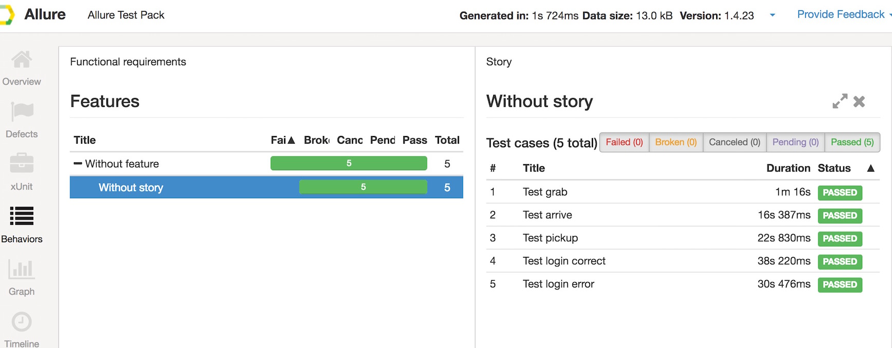

# Link

[移动端自动化测试系列之一——Appium环境搭建](http://mio4kon.com/2017/04/12/%E7%A7%BB%E5%8A%A8%E7%AB%AF%E8%87%AA%E5%8A%A8%E5%8C%96%E6%B5%8B%E8%AF%95%E7%B3%BB%E5%88%97%E4%B9%8B%E4%B8%80%E2%80%94%E2%80%94Appium%E7%8E%AF%E5%A2%83%E6%90%AD%E5%BB%BA/)

[移动端自动化测试系列之二——pytest入门详解](http://mio4kon.com/2017/04/12/%E7%A7%BB%E5%8A%A8%E7%AB%AF%E8%87%AA%E5%8A%A8%E5%8C%96%E6%B5%8B%E8%AF%95%E7%B3%BB%E5%88%97%E4%B9%8B%E4%BA%8C%E2%80%94%E2%80%94pytest%E5%85%A5%E9%97%A8%E8%AF%A6%E8%A7%A3/)

[移动端自动化测试系列之三——Allure测试报告](http://mio4kon.com/2017/04/12/%E7%A7%BB%E5%8A%A8%E7%AB%AF%E8%87%AA%E5%8A%A8%E5%8C%96%E6%B5%8B%E8%AF%95%E7%B3%BB%E5%88%97%E4%B9%8B%E4%B8%89%E2%80%94%E2%80%94Allure%E6%B5%8B%E8%AF%95%E6%8A%A5%E5%91%8A/)

[移动端自动化测试系列之四——生成定位元素](http://mio4kon.com/2017/04/13/%E7%A7%BB%E5%8A%A8%E7%AB%AF%E8%87%AA%E5%8A%A8%E5%8C%96%E6%B5%8B%E8%AF%95%E7%B3%BB%E5%88%97%E4%B9%8B%E5%9B%9B%E2%80%94%E2%80%94%E7%94%9F%E6%88%90%E5%AE%9A%E4%BD%8D%E5%85%83%E7%B4%A0/)

[移动端自动化测试系列之五——AppiumLich框架使用](http://mio4kon.com/2017/04/13/%E7%A7%BB%E5%8A%A8%E7%AB%AF%E8%87%AA%E5%8A%A8%E5%8C%96%E6%B5%8B%E8%AF%95%E7%B3%BB%E5%88%97%E4%B9%8B%E4%BA%94%E2%80%94%E2%80%94AppiumLich%E6%A1%86%E6%9E%B6%E4%BD%BF%E7%94%A8/)


# Environment

## Python3:

	brew install python3
	pip3 install <name>

* Appium-Python-Client
* Jinja2
* PyYAML
* pytest
* pytest-allure-adaptor
* watchdog
* termcolor  (not needed)

## Appium 

	npm install -g appium
	npm install -g appium-doctor

`appium-doctor` to ensure your system is set up properly

[more](https://github.com/appium/appium)

## Allure-Commandline

**Allure Framework** is a flexible lightweight multi-language test report tool with the possibility to add screenshots, logs and so on. It provides modular architecture and neat web reports with the ability to store attachments, steps, parameters and many more. 

	brew tap qatools/formulas 
	brew install allure-commandline


**TODO**:  use Jenkins Plugin  

[more](https://github.com/allure-framework/allure1/wiki)

# Run Test

start appium service:
	
	appium --address 127.0.0.1 --port 4723 --log "log_path" --log-timestamp --local-timezone --session-override
	
run test:

	cd project_path
	python3 run.py

**Html-Report** will be generate on `project_path/report/html/index.html`

report shot:




# Write Test Case

## 开启watchdog

	cd project_path
	python3 watch_dog.py

打开 `project_path/page/yaml/xxx_page.yaml`,以下面模板定位元素:

```xml

---
LoginPage:
  dec: 登录页面
  locators:
    -
      name: 注册
      timeOutInSeconds: 20
      type: name
      value: 注册
```


## 写测试case

```python
class TestLogin:
    def test_login(self, action: ElementActions):
        L.d('test_login')
        account = Steps.get_account()
        action.click(HomePage.登录入口)
        action.text(LoginPage.账户, account[0])
        action.text(LoginPage.密码, account[1])
        action.sleep(1)
        action.click(LoginPage.登录)
        assert action.is_toast_show('欢迎回来')
```

# ChangeLog

* 将原先所有元素全都写在 `pages.yaml`中方式改为可拆分的形式(`xxx_page.yaml`),方便管理.详见: `/page/yaml/`

# TODO

* 兼容iOS
* 集成 [stf](https://github.com/openstf/stf)


# License

MIT


